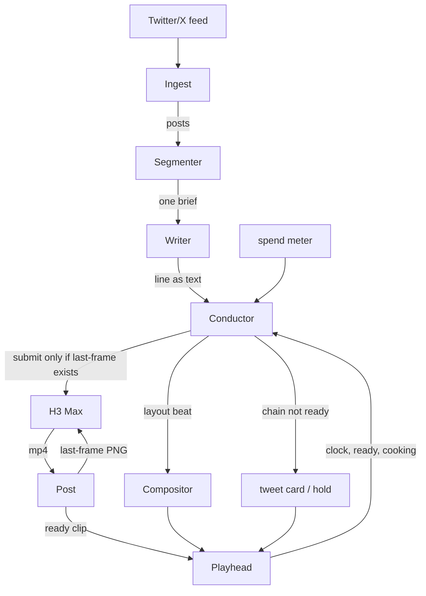

# Conductor layer

This is a requirements brief, not a build. No code. Nothing here calls fal (the video API we buy clips from).

## What this project is

`desk-show-live` is the spec for a fake live desk show. An original cartoon host sits at a desk and comments on a feed (Twitter/X). We do not generate a whole new world each time. We buy short talking-head clips from MiniMax H3 Max on fal, play them in a row, and composite the host over a static set plus a real tweet card.

H3 Max is a clip model, not a livestream. You send a prompt (and usually a first-frame image), wait, and get back a 5-second mp4 with picture and sound welded together. A 5-second clip at 768p costs $0.04/s on the promo rate through 1 Sep 2026, then $0.08/s. It takes about as long to render as it lasts.

To keep the host looking like the same person, each new clip starts on the last frame of the last clip. That is the last-frame chain. The last frame does not exist until the clip finishes, downloads, and we extract the PNG. So we cannot start take N+1 when N is submitted. We play N while N+1 cooks. That is the only overlap.

The rest of this repo has the older TDD and H3 Max spec. Those stay. This page adds the layer around the clips.

## What the conductor is

The conductor is the piece that decides, at each cut, what is on screen and for how long. It is a director sitting in front of a switcher. It never writes dialogue.

H3 Max is one camera, and it is a slow camera. If that camera is the only thing on screen, the show freezes the first time a take is late. Three seconds of a frozen face looks broken. The same three seconds on a tweet card, with the music bed still up, looks like a show taking a beat. The conductor's job is to turn generation delay into that beat.

## Who does what

- **Ingest** pulls posts. It does not rank or write.
- **Segmenter** turns the pile into a short "talk about this next" queue.
- **Writer** writes the spoken line from that brief. It can run a line or two ahead. It never picks a layout.
- **H3 Max** only performs a line it is already given. It returns no transcript.
- **Compositor** lays the host clip over the set and the tweet card. Deterministic. No opinions.
- **Playhead** is what is actually playing right now. Wall-clock truth.
- **Conductor** picks layout, source, and duration. It may set resolution and whether the next take chains off the last frame or re-anchors to the hero still. It does not touch prompt text.
- **Operator (Jesse)** can override at the next clip boundary. Clips are atomic: picture and sound are welded, so no mid-clip cut.
- **Spend meter** can refuse a submission. It is a brake.

## What can be on screen

Sort sources by how they bill, not by "camera vs graphic."

**Metered:** the H3 Max host window. This is the only thing that costs money every time.

**Bake once:** the set plate, the hero still, an idle/listening loop, a short sting, the outro. Made offline, reused forever.

**Free:** the tweet card (real post text, never baked into H3), lower thirds, clock, music bed, a freeze on the last frame.

Day one is one metered window plus those graphics. Do not generate eight extra angles. That is eight bills. Two generated windows on screen at once is worse than 2x cost: both have to be ready at the same instant, so stall risk goes up faster than the bill.

## Timing

The TDD said generation of N+1 starts when N is submitted. That is not possible while the last-frame chain is in use. Play N while N+1 cooks.

Turnaround (submit to next-frame-ready) is about 4–6 seconds. Playback is 5 seconds. The one-host chained loop sits at roughly 100% duty cycle: no slack. If turnaround lands above ~4.5s, some of the show *must* be non-host material. Graphics beats are how the 60-second test passes on purpose, not by luck.

With one window on air, you never bill more than 60 generated seconds per show-minute: $2.40/min promo, $4.80/min list. Every graphics beat is a discount. Waste (takes you generate and never air) is the only way past that ceiling.

Log `chain_ready_at` per take: the timestamp the next take's anchor frame became usable. That number sizes the graphics share. Guessing it is how this whole page stays fiction.

## Lock these

1. One generated video window on screen, ever, in v1. Graphics and bake-once assets are the other cameras.
2. Writer decides what is said. Conductor decides what is seen and when. The conductor never writes prompt text.
3. Rehearsal mode first: a stub performer that returns existing clips after a jittered delay, fal off, spend at zero. Tune the rules there. Live conductor time is ~$2.40/min promo.

On day one the conductor can just return "host full screen" every time, and "hold" when the queue is dry. Same behavior as the TDD. The point is the seam exists.

## Jesse still has to pick

1. **Audio:** keep H3's welded audio, or move voice to TTS? Host-talking-over-a-graphic costs full price today, because you pay for pixels you cover up. TTS makes that beat free and makes clip length predictable. The trade is lip sync. Wait for the TDD's E1/E2 results. No default.
2. **Clock or open-ended?** A 12-minute episode with a rundown is a different machine from a block that just has to stay alive. No default.
3. **Attended or unattended?** If someone is at the desk, a ~5s review delay buys a veto on ugly takes. If not, the layout mix has to be more conservative on its own.

Also still open, with defaults: cards are text-only, truncated, images stripped, until a safety pass exists. Whose feed is still unset.

## The surprise

A second host is a timing fix, and it is close to free.

The older spec said two hosts double the bill. True only if both are on screen at once. If they alternate (the locked design), only one window airs, so cost per show-minute does not change.

The last-frame chain is per host. Sequence A1, B1, A2, B2: A2 needs A1's last frame, which was ready long before B1 finished airing. Each host's chain gets two playback windows of slack instead of one. A loop at ~110% duty cycle with one host runs at ~55% with two. Same bill. Continuity holds. The new risk is waste: generating ahead means sometimes paying for a take you never air.

That is a stronger argument for the second host than banter. Do it after the one-host 60s loop holds.

## Out of scope for now

No livestream / RTMP.
No video-wall UI.
No second generated window at the same time.
No generated cutaways.
No plugging into fal's own H3 Max Live Twitch bot. Same clip API. We can steal a playhead-to-stream layer later.

First build is unchanged: one host, 5s, 768p, last-frame chain, static JPEG, no tweets, no cutout. Done when 60s does not stall, hold fires on purpose, the chain is visible across 8+ takes, and we have a real $/min including retries.

## Two cheap measurements

8s and 10s takes once (~$1.20 promo). A chunk of turnaround is fixed per take (queue, download, extract, upload). Longer clips may give slack for the same money per show-minute. Render time may also grow worse than linear. Nobody knows until we measure.

`minimax/h3-max/reference-to-video` shipped 29 Aug. Ten takes (~$2 promo). If a pinned host still holds identity without the previous last frame, the serial chain this page is designed around goes away, and takes can cook in parallel. Measure before we commit to conductor rules that only exist to work around that chain.

## I/O map (one turn)



A layout beat is one cut: which shot (`host_full`, `host_plus_card`, `card_full`, `idle`, `hold`), the source, and the duration. It is not a line of dialogue.


This is the contract, not a schema to implement. One fake tweet walks every step so you can see what each piece is allowed to know and what it is allowed to emit. First-slice code (the TDD) only runs writer → H3 Max → post → playhead. Ingest, segmenter, conductor, and compositor are the show path around that.

Shared clock at the start of this turn:

```
t = 00:12.4
on_air        = take 2 (host, 5s, ends at 00:15.0)
ready         = []
cooking       = take 3 (submitted at 00:10.1, last-frame of take 2 is the first frame)
chain_ready   = false          # take 3 has not finished, so take 4 cannot start
spend_usd     = 0.60
spend_cap_usd = 20.00
holds_recent  = 0
written_ahead = [line 4]       # writer is allowed to run ahead; video is not
```

### 1. Ingest

Does not write. Does not pick what to talk about. Pulls posts.

**Context it sees:** feed source, cursor / `since_id`, nothing about the show.

**In**

```
GET /2/tweets/search/recent
query=from:marketsguy OR list:deskshow
since_id=1950123456789012345
```

**Out**

```json
{
  "posts": [
    {
      "id": "1950123999999999999",
      "ts": "2026-08-29T23:41:02Z",
      "author": "marketsguy",
      "text": "the vix just did a thing and nobody knows why",
      "url": "https://x.com/marketsguy/status/1950123999999999999",
      "media": []
    }
  ],
  "cursor": "1950123999999999999"
}
```

Writer never sees this list. If it did, it would start fetching.

### 2. Segmenter

Turns the pile into a "talk about this next" queue. One brief per upcoming line. It can look at the last few topics so it does not repeat. It cannot write dialogue.

**Context it sees:** new posts, last 3 briefs that already aired or are queued, host names. It does not see last-frame URLs, spend, or playhead time.

**Prompt**

```
You are the segmenter for a one-host desk show.
The host is a robot anchor. They comment. They do not report news.

You get new posts and the last few briefs.
Return exactly one JSON object, no prose:
{
  "item_id": "<post id>",
  "angle": "<one sentence, what to talk about>",
  "beats": 1
}

Rules:
- Pick the post that is most commentable right now.
- Do not write the spoken line.
- Do not invent facts that are not in the post.
- If nothing is worth a line, return {"skip": true}.
```

**In (user)**

```json
{
  "new_posts": [
    {
      "id": "1950123999999999999",
      "author": "marketsguy",
      "text": "the vix just did a thing and nobody knows why"
    }
  ],
  "recent_briefs": [
    {"item_id": "1950123000000000001", "angle": "a screenshot of a broken chart"},
    {"item_id": "1950123111111111111", "angle": "someone claiming the tape is fake"}
  ]
}
```

**Out**

```json
{
  "item_id": "1950123999999999999",
  "angle": "the VIX moved and the poster admits they have no thesis",
  "beats": 1,
  "skip": false
}
```

### 3. Writer

Writes the spoken line. One line. It does not pick layout. It does not call fal.

**Context it sees:** persona, last N spoken lines, the next brief, who is speaking. It does not see the playhead, the last-frame URL, or the spend meter.

**System prompt**

```
You are the writer for a desk show.
Host: UNIT, original robot anchor. Flat robotic monotone, mid-pitch.
You output one spoken line only.
Hard rules:
- plain text, no quotes, no stage directions
- 12 words or fewer
- ends on a period
- do not mention that you are an AI
- do not fetch posts
```

**In (user)**

```
Transcript:
UNIT: The tape is a rumor with a timestamp.
UNIT: That chart is a screenshot of a feeling.

Next brief:
angle: the VIX moved and the poster admits they have no thesis
author: marketsguy
text: the vix just did a thing and nobody knows why

Write UNIT's next line.
```

**Out**

```
Fear has a ticker now, and it shrugs.
```

That string is line 4. It sits in `written_ahead` until the conductor spends it.

If H3 Max later 422s this take, the writer is called again with the same brief plus `reissue: shorter, blander`. It does not get the failed video.

### 4. Conductor

Picks what is on screen, and whether to spend a take. It never writes the line.

**Context it sees:** everything about timing and money, plus the next written line as opaque text. It does not get the tweet pile. It does not rewrite `line`.

**In** (the whole job is this snapshot)

```json
{
  "t": 12.4,
  "on_air": {
    "kind": "host",
    "take": 2,
    "duration_s": 5,
    "ends_at": 15.0,
    "line": "That chart is a screenshot of a feeling."
  },
  "ready": [],
  "cooking": {
    "take": 3,
    "submitted_at": 10.1,
    "line": "The tape is a rumor with a timestamp."
  },
  "chain_ready": false,
  "next_line": {
    "take": 4,
    "speaker": "UNIT",
    "text": "Fear has a ticker now, and it shrugs."
  },
  "spend_usd": 0.60,
  "spend_cap_usd": 20.00,
  "holds_recent": 0,
  "anchor_reset_due": false
}
```

v1 is a function, not a model. Same snapshot in, one beat out. If we ever put a model here, the prompt is "given this snapshot, return one beat JSON, never a line of dialogue." Do not do that until the function is wrong in a way rules cannot fix.

**Out** (this cut, 00:15.0)

```json
{
  "at": 15.0,
  "layout": "card_full",
  "source": "post:1950123999999999999",
  "duration_s": 4.0,
  "submit": null,
  "why": "take 3 is still cooking; last-frame for take 4 does not exist; put the tweet up"
}
```

`updated_at` for the same clock, 400ms later, take 3 lands:

```json
{
  "t": 15.4,
  "on_air": {"kind": "card_full", "ends_at": 19.0},
  "ready": [{"take": 3, "path": "out/ready/003.mp4", "duration_s": 5}],
  "cooking": null,
  "chain_ready": true,
  "frame_url": "https://fal.media/files/007.png",
  "next_line": {"take": 4, "text": "Fear has a ticker now, and it shrugs."},
  "spend_usd": 0.80
}
```

**Out** (now it may spend)

```json
{
  "at": 15.4,
  "layout": "host_full",
  "source": "ready:3",
  "duration_s": 5,
  "submit": {
    "take": 4,
    "line": "Fear has a ticker now, and it shrugs.",
    "image_url": "https://fal.media/files/007.png",
    "anchor": "chain",
    "duration": 5,
    "resolution": "768p",
    "prompt_expansion_mode": "balanced"
  },
  "why": "ready clip exists; last-frame exists; spend is under cap"
}
```

Those are the only layouts in v1: `host_full`, `host_plus_card`, `card_full`, `idle`, `hold`. One generated video window. Never two.

### 5. H3 Max (performer)

Performs a given line. It does not pick the next topic. It does not see the tweet.

**Context it sees:** one performance prompt, one first-frame image, duration, resolution. That is the entire world.

**Request** (`fal.subscribe`, `minimax/h3-max/image-to-video`)

```json
{
  "prompt": "A chrome robot news anchor, LED-waveform mouth, flat robotic monotone, mid-pitch, looking at camera. The host says, verbatim: \"Fear has a ticker now, and it shrugs.\"",
  "image_url": "https://fal.media/files/007.png",
  "duration": 5,
  "resolution": "768p",
  "prompt_expansion_mode": "balanced"
}
```

**Out**

```json
{
  "video": {"url": "https://fal.media/files/take004.mp4"},
  "timings": {"inference": 2.7}
}
```

We download immediately to `out/raw/004.mp4`. A 422 from the safety checker is not a retry of the same prompt. Drop the take, tell the writer to reissue shorter, play `hold`.

### 6. Post

Makes the next take possible. Extract last frame as PNG (never JPEG), upload it, write the treated audio if the toggle is on, drop a manifest row.

**In:** the raw mp4 plus the take number.

**Out**

```json
{
  "take": 4,
  "line": "Fear has a ticker now, and it shrugs.",
  "clip": "out/ready/004.mp4",
  "raw": "out/raw/004.mp4",
  "anchor": "chain",
  "frame_png": "out/frames/004.png",
  "frame_url": "https://fal.media/files/008.png",
  "voice_effect": true,
  "t_inference_s": 2.7,
  "cost_usd": 0.20,
  "cost_cum_usd": 1.00,
  "status": "ready"
}
```

`frame_url` is the only picture the next H3 Max call is allowed to see. If extract or upload fails, next `image_url` is `assets/hero.png` and `anchor` is `"hero"`. Do not stall.

### 7. Compositor

First slice: the player *is* the compositor. Full-frame talking head, no set, no card. Later slice: host over a static set JPEG plus a real tweet card, never baked into H3 Max.

**Context it sees:** the current beat (`layout`, `source`, `duration_s`) plus file paths. It does not call fal. It does not write.

**In**

```json
{
  "layout": "host_plus_card",
  "host": "out/ready/003.mp4",
  "set": "assets/set.jpg",
  "card": {
    "author": "marketsguy",
    "text": "the vix just did a thing and nobody knows why",
    "url": "https://x.com/marketsguy/status/1950123999999999999"
  },
  "duration_s": 5
}
```

**Out:** frames (or one mp4) the playhead can put on air. The tweet text on screen is this card, not anything inside the H3 Max prompt.

### 8. Playhead

Plays what the conductor handed it. mpv `--keep-open` on a playlist. When the playlist is dry, the last frame freezes. That freeze *is* `hold`. No custom player.

**In:** `loadfile out/ready/003.mp4 append-play`

**Out (state, not a file)**

```json
{
  "now_playing": "003.mp4",
  "kind": "host",
  "ends_in_s": 4.2,
  "queue_depth": 0
}
```

## What is allowed to know what

| Step | Sees | Must not see |
| --- | --- | --- |
| Ingest | feed, cursor | lines, spend, frames |
| Segmenter | posts, recent briefs | playhead, frames, spend |
| Writer | persona, transcript, one brief | posts list, frames, spend, layout |
| Conductor | clock, queues, next line as text, spend | tweet pile, permission to rewrite the line |
| H3 Max | prompt + first frame + duration | tweets, transcript, spend |
| Post | the mp4 it just got | the next line |
| Compositor | beat + files + card | fal |
| Playhead | ready files | anything upstream |

The only state that crosses video turns is the line as text plus that host's last-frame PNG URL. Writer state is the rolling transcript. Conductor state is the snapshot above. Do not merge those three memories.
