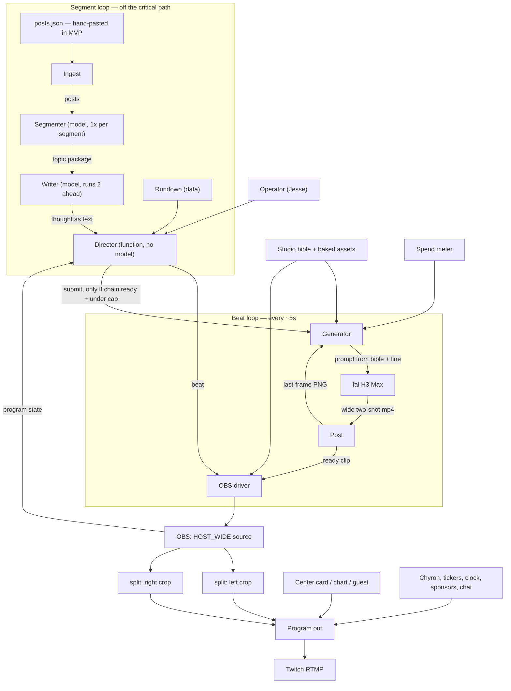

# Runtime — Two-Host Architecture & Harness

**Historical.** The live lock is now solo PHASEONE with chat. See `SHOW.md`.

**Status:** Architecture, agreed in conversation 30 Aug 2026 · **Owner:** Jesse

**See also:** `Agentic Live Streaming Harness — Plan.md` — who is in charge if agents run the show. `OBS Harness — TDD.md` — public runner (OBS beside us, fake clips, $0). `Live Sockets — TDD (text API + fal H3).md` — their text key and fal key, later. `Desk Show — Embodied Agent Podcast.md` — 2 Sep 2026 proposal to take fal off the live path and put HostMind + face UI in the wells. None of these replace this file until that proposal is accepted.

This supersedes parts of the two earlier docs. Read the amendment list in §1 before trusting anything in "H3 Max Spec + Review + Drift Plan", the "MVP TDD", or the "Conductor Layer Brief". Everything not amended still stands.

Still a requirements doc. No code yet.

---

## 1. What changed, and what it kills

| Earlier doc said | Now |
| :---- | :---- |
| One host, full-frame talking head | **Two hosts in one generated wide two-shot** |
| Second host doubles cost, or needs alternating turns | Second host is **free** — same clip, same bill |
| Compositor is ffmpeg / mpv / a custom player | **OBS**, driven over `obs-websocket` |
| Hold pattern = mpv freeze-frame | Hold is a **layout**: card up, tickers running, bed playing |
| Conductor picks camera cuts | **Director picks layouts.** No cutting between generated angles |
| Last-frame chain per host, or per camera | **One chain.** One generated asset, one chain |
| Original robot host, for drift tolerance | **Stylized 2D cartoon hosts**, for the same reason |
| Streaming out of scope | **Twitch is the target.** RTMP is an OBS checkbox |
| "One generated video window, ever" | **One *metered* window.** The wide two-shot is the only thing we pay for |
| Voice path was undecided | **H3-first for the first flight.** Measure native voice before adding a third provider. |

Voice decision for the first live flight:

- **H3 native audio first.** H3 generates picture and programme audio together. Each Character Pack supplies a narrow `voice_direction`, and the video prompt deliberately includes the active host's direction. This keeps voice and gesture timing in one generation and avoids adding a third live provider before native voice quality is measured.
- **Measure, then decide.** The flight scores voice consistency within each host, distinction between hosts, intelligibility, dialogue fidelity, and voice/gesture alignment. If H3 fails those gates, TTS-first becomes the next flight rather than hidden fallback behavior in this one.
- **Reserve TTS without activating it.** Character Pack v2 may store optional TTS provider, voice ID, speed, pitch, pronunciation, duration, and license metadata. Those fields do not trigger calls in the H3-first flight.
- **Archetype, not persona remains held.** Original characters and voices only. No named person, soundalike, cloned voice, show, studio, or character in a generation prompt.

**Pricing note:** the 50% promo (768p at $0.04/s) runs through **1 Sep 2026**. From 2 Sep it is $0.08/s. Every number below is given at both rates. Bake assets and run experiments before Monday.

---

## 2. The show

A live desk show on Twitch. Two original cartoon hosts sit at a desk and talk about a feed. The frame looks like a real production: name bars, headline chyron, sponsor bar, market ticker, clock, LIVE badge.

The trick that makes it affordable: **we generate one thing and one thing only — a wide two-shot of the desk.** Everything else on screen is deterministic code.

---

## 3. Aesthetic

Flat-color 2D cartoon animation. Heavy uniform linework. Simplified geometric faces with large expressive eyes and few moving parts. Retro-futurist set dressing — chrome, CRTs, neon, warm saturated palette. The world is a tech/VC studio in San Francisco: hoodies, standing desks, energy drinks, a monitor wall.

This is an engineering decision as much as an art one:

1. **Drift tolerance.** Flat art has few facial degrees of freedom. Take-to-take drift reads as animation inconsistency, which cartoons have anyway. Photoreal human faces drift worst; viewers track every parameter.
2. **Scaling tolerance.** Half-frame crops get rescaled into the canvas, and at 480p that means real upscaling (§4.4). Flat art survives it. Photoreal would look like a bad webcam.

**Prompt rule, non-negotiable:** never name a show, studio, artist, or character in a prompt. Describe the style in our own words. Naming IP invites both a safety-checker 422 and the exact Twitch DMCA outcome that got the original inspiration for this project banned.

Hosts are `BOT1` (camera-left) and `BOT2` (camera-right). Working names, deliberately plain — the characters carry the show, not the names. Show name is still open.

---

## 4. The frame

### 4.1 One generated asset

Every take is the same shot: **a wide two-shot of both hosts at the desk.** `BOT1` sits camera-left and faces slightly right. `BOT2` sits camera-right and faces slightly left. That never changes.

The wide splits straight down the middle:

```
  0%                    50%                   100%
  |----------------------|----------------------|
  |      LEFT HALF       |      RIGHT HALF      |
  |         BOT1         |         BOT2         |
  |----------------------|----------------------|
```

In the `split` layout, each half is cropped and placed on its side of the canvas, and the **card sits on top** of the middle, covering the seam where they meet. The card is a layer, not a third box.

That keeps the art brief ordinary: it is just a two-shot of two people at a desk, one on each side. The only soft constraint is that each host sits a little outboard of centre in their own half, so the card does not cover them — which is how people sit at a desk anyway.

The composition contract is therefore weak: **one host per half, and they do not swap sides.** It is set by the hero still (§5.2) and held by the chain. E1 tests it.

### 4.2 Layouts

A layout is an OBS scene. All of them are free and instant — they are transforms on the same media source.

| Layout | What is on screen |
| :---- | :---- |
| `wide` | The generated frame, full width, one box. Both hosts. |
| `split` | Two cropped instances of the **same source** — left half, right half — placed either side of the canvas, with the centre card layered on top of the seam. |
| `solo_l` / `solo_r` | One crop, enlarged. For when one host is on a run. |
| `card_full` | Center content full-frame, H3 programme audio still playing underneath. |
| `hold` | Card or bumper up, tickers running, music bed up. The failure layout. |

`split` is the signature look. `wide` is the establishing shot and the reset. Moving between them is a real-feeling camera move that costs nothing.

**Mechanically:** in OBS, one media source (`HOST_WIDE`) is added to the split scene twice. Both scene items reference the same source, so they share a playhead and stay in sync. Each item carries its own crop in its transform (`cropLeft` / `cropRight` / `cropTop` / `cropBottom`), settable live over `obs-websocket`. Verify this in M0 before building on it.

### 4.3 The deterministic layer

None of this costs anything, none of it has latency, and it is most of what makes the show read as a real production.

- **Top:** clock + LIVE badge, show logo, "presented by" slot
- **Boxes:** name bars with handles, and an **on-air highlight** on whichever box is speaking
- **Center:** tweet card, chart, image, guest slot, or absent
- **Bottom:** headline chyron, sponsor ticker, market ticker
- **Optional:** Twitch chat piped in as a source

The **on-air highlight** is cheap insurance. We always know who is supposed to speak, so we draw it. If H3 gives voice or motion to the wrong sprite, the recording makes that failure measurable.

---

### 4.4 Resolution

Canvas and generation are separate decisions, and the crop matters more than either.

**H3 Max outputs 480p or 768p only.** There is no 1080 or 2K on this endpoint. 768p 16:9 is 1344×768 at 24 fps.

**Stream the canvas at 1920×1080 regardless.** The chyron, tickers, name bars, sponsor bar and centre card all render at true 1080 and stay razor sharp. That is most of the pixels on screen and most of what makes the frame read as a real broadcast. Only the host boxes are ever scaled.

The `split` crop is what sets host-box quality, and a 50/50 crop is generous — each half keeps 672 of the 1344 px. Against a canvas where the card takes the middle ~35% and each host box gets roughly 620×700:

| Generated at | Half-frame crop | Into a ~620×700 box | Cost/min (promo / list) |
| :---- | :---- | :---- | :---- |
| 768p (1344×768) | 672×768 | **no upscale** — slight downscale | $2.40 / $4.80 |
| 480p (854×480) | 427×480 | **~1.45×** | $1.50 / $3.00 |

768p needs no upscaling at all in `split`. 480p is a mild 1.45× and, on flat 2D art, may well be indistinguishable — which makes the 38% discount genuinely worth testing (E7).

The `wide` layout is the harder case, since the full frame stretches across the canvas: 1.43× from 768p, 2.25× from 480p. If 480p fails anywhere it will fail here first, so E7 must judge both layouts, not just `split`.

**Baked assets are not capped.** The hero still, bumpers, ad reads and stings are made off-air, where slow is fine. Generate them large and downscale. The anchor PNG must match the live frame size, but the art it is derived from does not have to.

## 5. The locked baseline

Character Packs, one Scene Pack, and approved assets give the system spatial and voice truth. The Pack Manager versions them and locks one immutable baseline for a run. The video model does not need to remember the room or voices; every take receives the same locked descriptions.

Root `studio.yaml` is an editable visual-research draft, not runtime truth. Live prompts use only hash-verified Character/Scene Pack v2 data from the locked baseline export.

### 5.1 Schema

```yaml
baseline:
  frame: {w: 1344, h: 768, fps: 24}
  hero: {path: hero.png, sha256: locked}
  characters:
    BOT1:
      silhouette: broad rounded orange software sprite
      eye_design: two solid cream ovals without pupils
      proportions: low and wide
      voice_direction: low chest voice, slow and even, dry, almost bored
    BOT2:
      silhouette: tall cobalt software sprite
      eye_design: two solid cream rounded rectangles without pupils
      proportions: tall and narrow
      voice_direction: higher thinner voice, quick and clipped, bright, slightly nasal
  scene:
    set: clean light-mode technology broadcast studio
    palette: warm white, forest green, cobalt, signal orange
    lighting: bright soft broadcast light
  reanchor_every: 5
```

### 5.2 Baked assets

| Asset | What | Cost |
| :---- | :---- | :---- |
| Locked Pack Manager baseline (1344×768) | Canonical two-shot. Clip 0's anchor and every re-anchor. Bytes live in `pack-manager/data/`, not git. See `ASSETS.md`. | ~$1–2 of iteration |
| `hero_wide.png` (historical name) | Same idea. Root `assets/hero_wide.png` was **never committed**. Do not look there. | |
| Stings, bumpers, ad reads | Bake once, play free forever. Every one is a free show-minute. | ~$2–4 |
| Chyron / ticker / card templates | HTML. Free. | $0 |

Note we are **not** baking idle loops. The listener is animated inside the wide, by the same clip that animates the speaker. That was the whole point.

### 5.3 Prompt assembly

Every take's prompt is assembled the same way, mechanically:

```
locked scene + BOT1 visual invariants + BOT2 visual invariants
+ active host's voice_direction
+ "BOT1 is speaking" (or BOT2)
+ the line, verbatim, in quotes
```

The writer supplies only the line. The locked baseline supplies visual and voice direction. Nothing about the prompt is improvised at runtime, and reserved TTS fields never enter an H3 prompt.

---

## 6. The chain

One chain, for the whole frame.

- Clip 0 anchors on `hero_wide.png`.
- Take N+1 chains on take N's last frame, extracted as PNG (never JPEG — recompression compounds).
- Every `reanchor_every` takes (default 5), force the anchor back to `hero_wide.png`.
- **Hide every re-anchor behind a layout change** (`split` → `wide`, or the reverse). Layout changes are free and happen anyway; a small composition jump inside one is invisible.
- Extract or upload failure → anchor to hero, keep going. Never stall.

**Under test: end-frame pinning.** `image-to-video` accepts `end_image_url` as well as `image_url`. If we set the end frame to the canonical hero composition, every clip *returns* to canonical and drift cannot compound at all. The risk is motion or native speech that visibly snaps back before the line ends. Experiment E5. If it works, composition drift is close to solved and `reanchor_every` becomes a formality.

---

## 7. Cost

At 5s per take, one metered window:

| Rate | Per take | Per show-minute of host talk | Per hour, wall-to-wall |
| :---- | :---- | :---- | :---- |
| 768p promo (through 1 Sep) | $0.20 | $2.40 | $144 |
| 768p list (from 2 Sep) | $0.40 | $4.80 | $288 |

The rate did not change from the earlier docs. **The value did** — that same window now carries two hosts instead of one.

At 480p it is $1.50/min promo, $3.00/min list — a 38% discount, pending E7. See §4.4.

**Wall-to-wall talking is the ceiling, not the plan.** The lever for a Twitch-length block is how much of it is free:

- baked bumpers, stings, ad reads — free, and TBPN runs them constantly
- graphics beats: `card_full` with H3 programme audio still playing underneath (OBS keeps audio in the mixer independent of which scene is on programme)
- guest / chart / image in the center slot with the hosts quiet
- replays and pre-recorded segments

A block that is half free runs ~$72/hr promo, ~$144/hr list. That is the difference between a demo and something you can leave running. Waste — takes generated and never aired — is the only way past the ceiling, so the director must not generate speculatively.

**Build budget:** baking ≈ $4–6, experiments ≈ $10–14, shakeout ≈ $6, a handful of 90s segments ≈ $6. Base ≈ $30, with a 1.8× mess multiplier ≈ **$54**. **Spend meter hard cap: $50**, raised only deliberately.

---

## 8. Roles

Collapsed hard, on purpose. Latency and coordination complexity were the stated concerns, so **exactly one model call sits on the live loop, and it runs ahead of the video.**

| Role | What it is | Where it runs |
| :---- | :---- | :---- |
| **Ingest** | Supplies posts. **A fixed JSON file in the MVP** (§15). Live API later. | Function. No model. |
| **Segmenter** | Opens one topic: question, framing, angles. | Model, **once per segment**. Off the critical path. |
| **Writer** | Writes the next complete thought for whoever is speaking. Runs 2 thoughts ahead. | Model. Never blocks the loop. |
| **Director** | Picks the layout, the center content, the chyron, and whether to spend a take. | **Plain function. Rules, no model.** |
| **Generator** | Assembles the prompt from the bible, calls fal, enforces the spend cap. | Function. |
| **Post** | Downloads and validates H3 picture/audio, extracts/uploads the last-frame PNG, and files a manifest row. | Function. |
| **OBS** | Compositor and playhead. | Not our code. |

**Writer duration contract:** target natural speech that H3 can deliver in roughly 4.0–4.6 seconds. This is a prompt target, not blind truncation by word or character count. The flight records actual native-audio duration and human-rated fidelity; it does not pretend text length proves delivery.

The I/O contracts and the "what is allowed to know what" table in the Conductor Layer Brief still apply, with `Conductor` renamed to `Director` and `Compositor` + `Playhead` both becoming OBS.

**Noted for later, not built:** a model-driven **Producer** at the rundown level — judgment about pacing, "we are long, cut a beat", "spend is hot, go to a bumper". Only build it when the director's rules are provably wrong in a way rules cannot fix.

---

## 9. The harness

The harness is the runtime that executes a rundown. It has three modes, and **the same code path serves all three**:

| Mode | Performer | Spend | Use |
| :---- | :---- | :---- | :---- |
| `rehearse` | Stub — returns pre-existing clips after a jittered delay | **$0** | Tune director rules, layouts, chyrons, timing. Most development happens here. |
| `live` | fal | Real | The show. |
| `replay` | Reads a past `takes.jsonl` | $0 | Reproduce a run exactly. Debug a specific failure. |

Rehearsal mode is not a nice-to-have. Live director time is $2.40–4.80 a minute; every rule you can tune for free, you tune for free.

### 9.1 Two loops

**Segment loop** — every ~90s, entirely off the critical path:

```
rundown advances
  → ingest pulls posts
  → segmenter opens one topic package
  → writer starts producing thoughts, runs 2 ahead
  → director loads the segment's layout plan, chyron, and center content into OBS
```

**Beat loop** — every clip boundary, ~5s:

```
OBS reports program state
  → director takes a snapshot (on air, ready, cooking, chain state, spend, segment clock)
  → director emits ONE beat
  → OBS driver executes it
  → if the beat says submit: generator assembles prompt from bible + line, calls fal
  → post: download, extract last frame, upload, manifest row, drop clip where OBS can reach it
```

Nothing in the beat loop waits on a model. All of its latency is fal's.

### 9.2 Diagram



### 9.3 The beat

```json
{
  "at": 15.4,
  "layout": "split",
  "host_source": "ready:7",
  "speaking": "BOT1",
  "center": {"kind": "tweet_card", "post_id": "1950123999999999999"},
  "chyron": "A MOVE WITHOUT A THESIS",
  "submit": {
    "take": 8,
    "line": "Fear has a ticker now, and it shrugs.",
    "speaker": "BOT1",
    "image_url": "https://fal.media/files/008.png",
    "anchor": "chain",
    "duration": 5,
    "resolution": "768p",
    "prompt_expansion_mode": "balanced"
  },
  "why": "ready clip exists; chain ready; under cap; 3 takes since re-anchor"
}
```

`submit` is `null` when the chain is not ready, the cap is hit, or the operator has vetoed. The director never writes `line` — it only carries it.

### 9.4 The rundown

```yaml
show: { name: Runtime, target_len_s: 900, loop: true }
segments:
  - id: cold_open
    kind: bumper
    asset: assets/bumpers/open.mp4
  - id: timeline_react_1
    kind: timeline_react
    target_len_s: 90
    layout_plan: [wide, split, split, wide, split]
    center: tweet
    chyron_from: topic.question
  - id: ad_1
    kind: bumper
    asset: assets/ads/sponsor_a.mp4
```

---

## 10. The OBS control surface

A thin client over `obs-websocket` v5, wrapped as an **MCP server** so the same surface serves both callers: the harness drives it at runtime, and a human or an agent drives it interactively to build and debug the studio.

```
get_program_state()          -> what is on air, media time remaining, source health
set_layout(name)             -> switch scene: wide | split | solo_l | solo_r | card_full | hold
play_clip(path)              -> point HOST_WIDE at a new file
set_speaking(host)           -> on-air highlight on the correct box
set_center(kind, payload)    -> tweet card | chart | image | guest | none
set_chyron(text)             -> headline
set_lower_third(host, name, handle)
set_ticker(track, items)     -> sponsors | markets
fire_sting(name)
duck_music(db)
set_crop(scene_item, rect)   -> live tuning of the split
```

The scene collection is **built by hand once**, with a documented naming convention, and mirrored in the studio bible so the agent does not have to introspect OBS on every call. The agent drives scenes and sources; it does not create or destroy them. That line exists so a bad call at 2am cannot dismantle the studio.

---

## 11. Operator

Attended from early on. The operator surface is a small panel, not OBS Studio Mode:

| Control | Effect |
| :---- | :---- |
| **Preview next** | The ready clip (queue depth 1) plays in a monitor while the current one airs. **This is free** — the clip already exists. |
| **Kill take** | Drop it, hold, writer reissues shorter and blander. Same path as a 422. |
| **Hold** | Force the hold layout. |
| **Next segment** | Advance the rundown now. |
| **Panic** | Cut to a bumper, stop submitting. |

Unattended is the same harness with the panel closed. The director's rules must be conservative enough to run without it, and the operator makes it *better*, not *possible*.

---

## 12. Failure modes

| Failure | Response |
| :---- | :---- |
| Take is late | Layout falls back to `card_full` or `hold`. Chyron stays up, bed keeps running. Reads as a beat in the conversation, not a freeze. |
| Safety 422 | Drop the take, cost still counted, writer reissues shorter and blander, hold. Never retry the same prompt. |
| Frame extract / upload fails | Anchor to `hero_wide.png`, mark `anchor: hero`, keep going. |
| Composition drifted out of the boxes | Force re-anchor, hidden behind a layout change. |
| OBS websocket drops | Reconnect with backoff. OBS keeps playing whatever is on program; a stale layout is survivable, a dead process is not. |
| 3 consecutive fal failures | Graceful stop: finish the queue, go to a bumper, exit with the manifest intact. |
| Spend cap | Refuse the next submit. Clean shutdown. |
| Adversarial post | Text-only cards, truncated, images stripped, until a safety pass exists. Live-path 422 rates will run far above test rates once a real feed drives prompts. |

---

## 13. Day-one experiments

Ordered by what kills the design. Each is a script in `experiments/`. E1–E6 can share the same 8-take chain.

| # | Experiment | Pass |
| :---- | :---- | :---- |
| **E1** | **Composition stability.** 8-take chain, contact sheet of every frame 0. Does each host stay in their own half? | One host per half for 8 takes, no side-swapping, neither buried under where the card sits. **Fail → the split layout does not work as designed; fall back to generated singles and re-cost.** |
| **E2** | **Speaker attribution.** Scripted lines alternate hosts. Does H3 give the intended sprite both the active motion and the audible line? | ≥ 7/8 correct. Fail → native H3 voice path does not work for the show. |
| **E3** | **Dialogue fidelity and intelligibility.** Transcribe and compare H3 audio with the Writer line, then score whether a listener can understand it. | Both fidelity and intelligibility ≥3/5 on every aired take; log omissions, paraphrases, garbling, and inaudible delivery. |
| **E4** | **Listener behavior and gesture sync.** Does the non-speaking host remain plausibly reactive, and do eye/body beats feel connected to the native speech? | Subjective ≥3/5 on every aired take. |
| **E5** | **End-frame pinning.** Same 8 takes with `end_image_url` = hero. Compare drift and motion quality against E1. | Drift lower, motion not visibly snapped-back. Pass → drift is solved. |
| **E6** | **Voice consistency, two hosts.** Blind listen to native H3 takes. | Each host is recognizable across 8 takes and the two voices are distinguishable; failure triggers the TTS-first follow-up flight. |
| **E7** | **Crop quality.** Same take at 480p and 768p, composited into the real 1080 canvas at real box size, in **both** `split` and `wide`. Compare side by side. | 768p acceptable by eye in both. Tells us whether 480p is viable — a 38% discount, and `wide` is where it will break first (§4.4). |
| **E8** | **90s segment.** Full harness, live. | No dead air; hold fires on purpose at least once; manifest complete. |
| **E9** | **$/segment.** From the manifest, including drops and retries. | A real number with retry overhead as a percentage. |

E1 is the one that can invalidate the architecture. Run it first, before anything else is built.

---

## 14. MVP

**One Timeline React segment, 90 seconds.**

One tweet in the center slot, both hosts in their boxes, roughly 10 beats of back-and-forth, headline chyron up throughout, ending on a sting.

**Done when** the one-tweet live flight reaches a terminal verdict. The scored definition lives in `docs/superpowers/plans/2026-08-30-one-tweet-live-test-flight.md` § End criteria. Summary:

- **S-CODE:** zero-cost harness proven. Agents stop here.
- **F-PASS:** one ≥90s OBS recording from the locked Dwarkesh packet; machine gates pass; native H3 voice and two-host composition both score ≥3. No TTS follow-up.
- **F-PATH:** same recording and machine gates, but native H3 voice fails. Close this flight and open TTS-first. Do not mix voice paths here.
- **F-ARCH:** recording exists, but composition or identity kills the split two-host design. Do not open TTS.
- **F-FAIL / F-INCONCLUSIVE:** the segment was not validly measured. One scoped fix plus one reflight, or re-run only the missing measurement.

Hold/card recovery and operator panic are proven in the zero-cost suite. A live hold is not required if no take was late. Reserved-cost upper bound is the $/segment number this flight records.

### Milestones

| # | Deliverable | Est. |
| :---- | :---- | :---- |
| **M0** | Studio bible written. `hero_wide.png` baked and approved by eye. OBS scene collection built by hand: `wide`, `split`, `hold`, furniture. **Crop-sync verified.** | ~3h |
| **M1** | Single-take path: assemble prompt from bible → fal → mp4 → last-frame PNG → upload → manifest row. Second run chains off the first. | ~2h |
| **M2** | **E1 and E2.** Stop here if E1 fails. | ~1h + ~$3 |
| **M3** | OBS command list, drivable by hand. See `OBS Harness — TDD` (H3). | ~3h |
| **M4** | Harness in `rehearse`. Public OBS cut is done at H4 of that TDD. | ~4h |
| **M5** | Live sockets: their text key + fal. See `Live Sockets — TDD`. **E3–E9.** | ~3h |
| **M6** | Twitch: RTMP out, one 90s segment on a real stream. | ~1h |

---

## 15. Open items

1. **Art.** The show is **Runtime**; the hosts are **PHASEONE[lol]** and **deb**. Root `studio.yaml` is reference only. M0 requires flight-ready Character/Scene Pack v2 versions plus one approved, locked 1344×768 hero baseline.
2. **Live feed source.** Resolved for the MVP: **no X API at all.** Ingest reads a hand-pasted JSON file of ~20 posts. It exercises every downstream stage, costs nothing, and is byte-identical across runs — which `rehearse` and `replay` both need. Whose timeline (or list, or search) it eventually pulls from is deferred until the show works; live ingest is then a swap of one function.
3. **Second generated framing.** v1 generates exactly one composition. A tighter two-shot as a "push in" for heated moments would need its own hero still and its own chain. Deferred until E1 says the first chain holds.
4. **Twitch chat.** Displaying it is nearly free and can land any time. Letting it *influence* the show is v2 and comes with the full adversarial-input problem.
5. **480p.** A 38% discount. E7 tells us whether the crop survives it. 1080 generation is not available at all — see §4.4.
6. **Producer model.** Noted in §8. Not built.
7. **Reference-to-video (test path, not live).** `minimax/h3-max/reference-to-video` shipped 29 Aug and accepts `reference_audio_urls` plus images. That is the API way to pin a voice without TTS. Live flights stay on `minimax/h3-max/image-to-video` (prompt + last-frame only). Measure the reference path off-air first — procedure in `experiments/e_voice_reference.md`. If a pin holds identity without the previous last frame, the chain — and most of §6 — can go away later. Ten takes, ~$2. TTS-first remains the E6-fail flight, not a mix.
